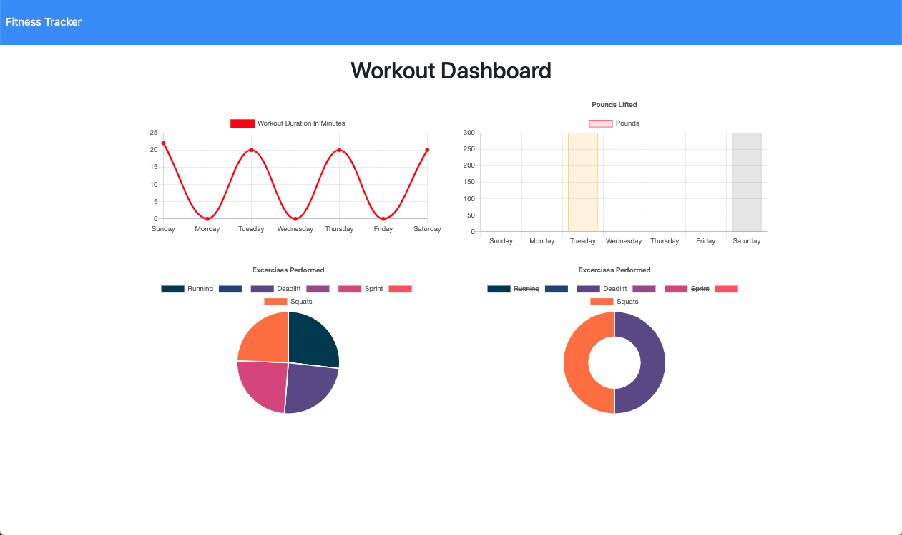

# Fitness-Tracker

This application has the ability to add new resistance workouts, new cardio workouts, and view the fitness dashboard showing workout stats.

## Description

* The application was created using a local server and the deployed version was created with Heroku.

* The workouts are saved using the Mongo database when you click add New Workout or Complete workout

* When you click the dashboard link in the top right corner, the dashboard takes you to the stats page where you can see graphs regarding your workouts.

* When you click the Fitness tracker link, it displays the Total Workout Duration, and number of Excercises performed.

## Link

 https://boiling-journey-67391.herokuapp.com/

 https://github.com/nickgusd/Fitness-Tracker

 ## Screenshot of application

 

 